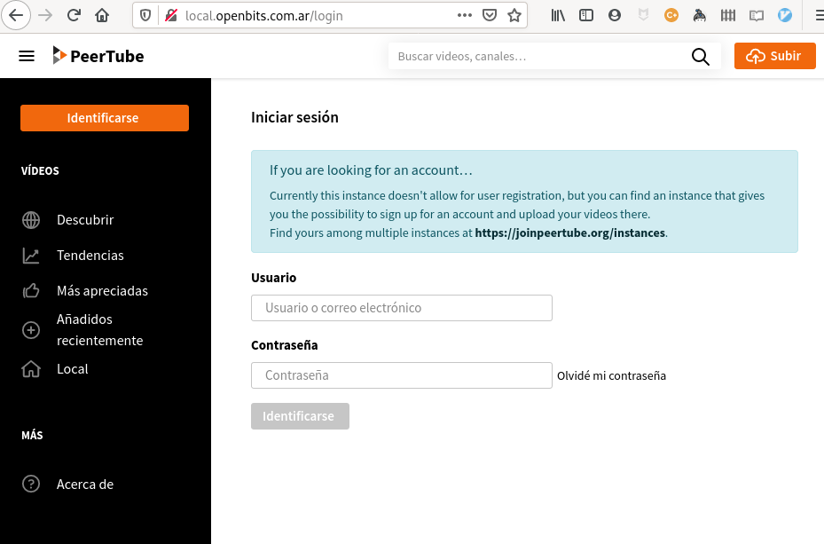

# Kubernetes Support

## Helm Chart

This helmchart deploys a postgres database, redis, and a peertube instance as PODs into a Kubernetes cluster. 

## Pre-requisites

Have a Kubernetes cluster (you could use **k3s** which can be installed just running a curl, [check their webpage](https://k3s.io/) for details.

Also you will need [helm](https://helm.sh/docs/intro/install/) (version 3). 

### Configuration

You should edit the file `values.yaml`, change hosts at ingress in line 45:

```yaml
ingress:
  enabled: true
  annotations: {}
  hosts: site.url.here
```

in the same file, you should edit the hostname entry at line 95, and if you enabled the tls entry for the ingress, you should enable https (which works as your proxy)

```yaml
  webserver:
    https: false
    hostname: 'site.url.here'
```

**Important**: Change the posgres passwords (line 128 and 486), and put a secure one. 


### Dependencies

You should download the charts for postfix (disabled by default), postgres and redis running `helm dependency update` into the helm's peertube directory:

```bash
$ cd peertube
$ helm dependency update
Saving 3 charts
Downloading postgresql from repo https://charts.bitnami.com/bitnami
Downloading redis from repo https://charts.bitnami.com/bitnami
Downloading postfix from repo https://halkeye.github.io/helm-charts/
Deleting outdated charts

```

### Deployment

Configure your `KUBECONFIG` to point to the clusters, then run `helm install -f values.yaml --name-template peer .`:

```bash
cd peertube                                       # if you follow the previous steps, you should be into this directory
helm install -f values.yaml --name-template peer . 
```

After some minutes, you will get the pods up and running

```bash
$ kubectl get pods
NAME                             READY   STATUS    RESTARTS   AGE
peer-redis-slave-0               0/1     Running   0          15s
peer-postgresql-0                0/1     Running   0          15s
peer-redis-master-0              1/1     Running   0          15s
peer-peertube-78b5bdbf97-jp7zc   0/1     Running   1          15s

```
To get the admin password, see the logs under your peer-peertube pod:

```bash
$ kubectl logs peer-peertube-78b5bdbf97-jp7zc | egrep "Username|password"
[local.openbits.com.ar:80] 2020-05-16 12:52:34.663 info: Username: root
[local.openbits.com.ar:80] 2020-05-16 12:52:34.663 info: User password: xxxxxxxxxxxxxxx

```

List the ingress to see if it's working

```bash
$ kubectl get ingress
NAME            HOSTS                   ADDRESS         PORTS   AGE
peer-peertube   local.openbits.com.ar   192.168.0.107   80      6m8s

```

You should be able to access to your service with the url in the HOST field.


